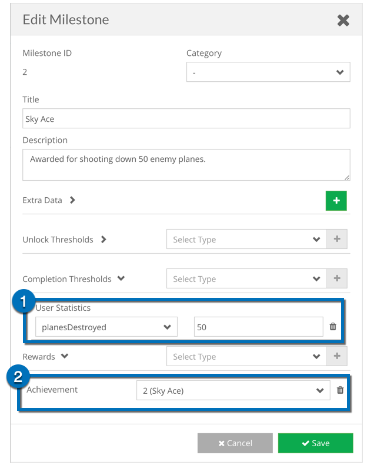

# **brainCloud Bombers**

brainCloud Bombers is an example project meant to show the compatibility between brainCloud and real-time multiplayer technologies (such as Unity 5 UNET and Photon). Players create accounts, log into the game, play against other players in real-time multiplayer battles, and their stats are saved between sessions via brainCloud. The example also shows various features of brainCloud, including:

- Experience levels and ranking up
- Custom player statistics and entities
- Multiple global leaderboards
- Achievement tracking and unlocking
- Global properties
- Email authentication

Please refer to the specific individual sections for some description, overview, and functionality of each feature.  _The source for both UNET and Photon versions of brainCloud Bombers can be found [here](https://github.com/getbraincloud/UnityExamples)._

Bombers XP & Stats Dashboard

## **Experience Levels and Ranking Up**

In brainCloud Bombers, players can earn experience for destroying enemy planes in-game. Experience is awarded at the end of each match and kept track of on the brainCloud servers. Players can view their total experience on the Matchmaking menu, beneath the player’s name. brainCloud also has custom levels defined, each having an experience value and a name. Players can see their current rank (as well as its numeric value) on the Matchmaking menu, beneath the player’s name. Experience is incremented live, so brainCloud sends messages to clients when they have made it to the next rank. This is shown to the player through a dialog that appears at the end of a match.

Experience and levels can be read through the PlayerStateService in the brainCloud API. The call returns the current player’s experience level and rank name/numeric value, all of which are saved as public member variables in the BrainCloudStats class. These stats are updated live on the brainCloud server, but on the local client, they are only updated when the player visits the Matchmaking menu, reducing the number of API calls required per user.

Xp levels

## **Custom Player \[User\] Statistics**

Every player in brainCloud bombers has a number of custom statistics that are stored on the brainCloud servers. These statistics include the number of ships they have sunk, the number of times they have fired their weapon, their total number of wins, and more. These statistics are updated at the end of each match. Players can view their statistics on the Matchmaking menu, where they are shown on the left side, below the player’s name. These statistics were created on the brainCloud design portal, and can also be edited from the monitoring section of the portal for each user.

User Statistics

Player statistics can be read through the PlayerStatisticsService in the brainCloud API. The call returns all of the current player’s statistics, including the statistics’ name, value, and description (all defined from the brainCloud dashboard), of which only the value is saved in public member variables in the BrainCloudStats class. These stats are updated live on the brainCloud server, but on the local client, they are only updated when the player visits the Matchmaking menu, reducing the number of API calls required per user.

## **Global Leaderboards**

brainCloud Bombers has two separate global leaderboards defined, that players may view at their leisure from the Matchmaking menu. The first leaderboard keeps track of the number of enemy plane takedowns that each player has, with the least number of deaths as the tiebreaker, and the second leaderboard keeps track of the number of ship weak-points destroyed by each player, with the least number bombs dropped as the tiebreaker. Both leaderboards feature the player’s place in the leaderboard, name, their rank (and numeric value of rank), and score. brainCloud keeps tracks of all aspects of the leaderboards, and scores are updated at the end of each match.

Leaderboards can be accessed through the SocialLeaderboardService in the brainCloud API. The call returns the entire listing of a given leaderboard, or can be broken up into just the current player’s score, or individual sections of the leaderboard with variable length. The values for the currently observed leaderboard are stored as a public member variable in the BrainCloudStats class. The leaderboards are updated live on the brainCloud server, but on the local client the leaderboards are only fetched when the player wishes to see them from the Matchmaking menu, reducing the number of API calls required per user.

Bomber Leaderboards

## Achievement Tracking

Three achievements have been implemented for brainCloud Bombers: destroying 50 enemy planes, sinking 10 ships, and destroying five enemy planes in a single match. brainCloud tracks whether the achievements have been unlocked or not, and can even automatically award the achievements based on player stats using Milestones. At the end of the match, bombers sends the stats updates to brainCloud, and then checks the response to see if any Achievements have been awarded.  \[Exception: note that the Quickshot achievement is handled manually by the client code in real-time during the match.\]

Achievements can be accessed through the GamificationService in the brainCloud API. The call returns all of the achievements in the system, their names, the urls for their icons, their descriptions, and whether or not the current user has unlocked any of them. The achievement data is stored in a public member variable in the BrainCloudStats class. The achievements are updated from the server when the player visits the Matchmaking menu.

Bomber achievements

 1. When this condition is satisfied.  
2\. Award this achievement.

## Global Properties

brainCloud Global Properties can be used in place of constants in your games - allowing games to be tuned and/or patched on the fly without having to release new builds. A number of properties have been utilized in brainCloud Bombers, to tune such things as player fire rate, respawn time, bullet speed, player health, and more.

These properties can be read through the GlobalAppService in the brainCloud API. The call returns all of the currently saved global variables, which are then stored as public member variables in the BrainCloudStats class. To reduce API calls from the client, these values are only read once when the game is started, meaning clients will need to restart the app to get any changes, but they could be checked more often for the sake of app security or faster testing.

Global Properties

## **Email Authentication**

brainCloud Bombers requires users to sign in with an email and password, with the authentication being done through brainCloud. If a player uses an email that hasn’t been registered, an account is created for them and an authentication email is sent to the email address used. brainCloud also has the ability to _require_ email authentication before being able to log in, though this feature is turned off for brainCloud Bombers. Players may also submit a "Forgot Password" request from the login screen, prompting them to enter their email and sending a password reset link to the entered email.

User authentication is done through the BrainCloudWrapper instance, and is taken care of on the server end. The server will send a message back saying whether the authentication was successful or not, and the error that occurred if it wasn’t successful. Since brainCloud Bombers uses external servers (UNET or Photon), the player must wait until they are connected to their servers before logging in to brainCloud. This requirement is optional; the services do not depend on each other - this is done under **Design | Authentication | Email Authentication**.

Email Authentication Settings

* * *

# **brainCloud Bombers App Overview**

_The source code for brainCloud Bombers can be found [here](https://github.com/getbraincloud/UnityExamples)._

brainCloud Bombers uses a mixture of scenes and state machines to achieve the flow-through for the game. Please refer to the following section for the general functionality of each of the classes. The scene and main class order is as follows:

1. Connect Scene
    1. Connect
    2. BrainCloudStats
2. Matchmaking Scene
    1. Matchmaking
3. Game Scene
    1. GameManager
    2. PlayerController
    3. WeaponController

**General Script Functionality**

- **Connect.cs**
    - Connects the user to the multiplayer server
    - Handles the email and password input for brainCloud
    - Handles error messages from the login process
    - Initializes the BrainCloudStats script after the player has logged in
- **BrainCloudStats.cs**
    - Reads a variety of information from the brainCloud server and stores it in public member variables
        - Statistics for the authenticated user
        - Experience and Level for the authenticated user
        - General information about experience levels (names, value, etc.)
        - General information about achievements (including whether the authenticated user has achieved them or not)
        - Global Properties for brainCloud Bombers
        - Social Leaderboards for brainCloud Bombers
    - Handles error messages from the brainCloud server
- **Matchmaking.cs**
    - Uses a state machine to implement functionality for a number of menus available to the player
        - GAME\_STATE\_SHOW\_ROOMS: Shows the main matchmaking menu, allowing the player to join games, create games, view the leaderboards, view the controls, view their achievements, and shows the player’s stats.
        - GAME\_STATE\_NEW\_ROOM\_OPTIONS: Shows the create new room dialogue, allowing the player to set the options for a new room, and then joining into it automatically
        - GAME\_STATE\_SHOW\_LEADERBOARDS: Displays one of the social leaderboards for brainCloud Bombers, allowing the player to switch between them, and displaying a chevron beside the player’s own entry (if one exists)
        - GAME\_STATE\_SHOW\_CONTROLS: Displays the basic controls for the game, as well as the goal and some instructions on what to do
        - GAME\_STATE\_SHOW\_ACHIEVEMENTS: Shows the available achievements for brainCloud Bombers, and tells the player whether they have achieved them or not.
    - Checks the multiplayer server for open rooms, and allows the player to join any room that is not full and within their level range.
    - Allows players to filter room results using a number of filters
- **GameManager.cs**
    - Uses a state machine to implement functionality for a number of menus available to the player
        - GAME\_STATE\_WAITING\_FOR\_PLAYERS: Shows the “Bombers Assemble” menu, showing the players connected to the game on both teams, giving players the ability to switch teams, and allowing the host to start the game prematurely before the room is full
        - GAME\_STATE\_STARTING\_GAME: Fades the screen in anticipation for the match to begin, telling players to get ready
        - GAME\_STATE\_PLAYING\_GAME: The main state, showing the players their HUD and handling a number of interactions for the actual game, including updating the local scores and tracking the time left in the match
        - GAME\_STATE\_GAME\_OVER: Shows the results screen to the players, telling them which team won and the scores for each player. The host may go back to the “Bombers Assemble” menu when they wish, and players may leave the room
    - Contains the majority of functionality for the live multiplayer, implementing a number of RPCs and controlling their effects (Photon version only)
    - Controls much of the game logic on the host side
- **PlayerController.cs**
    - Accepts inputs from the player to control their plane
    - Sends movement information to the player’s plane
    - Controls the health and death messages for the player’s plane
    - Contains the majority of  functionality for the live multiplayer, implementing a number of commands and client RPCs (UNET version only)
- **WeaponController.cs**
    - Accepts inputs from the player to control the weapons on their plane, including the main guns, bombs, and flares
    - Sends network messages through the **GameManager** to spawn projectiles of all sorts
    - Controls the bomb targeting reticule for the player
    - Controls the offscreen enemy ship indicator for the player
