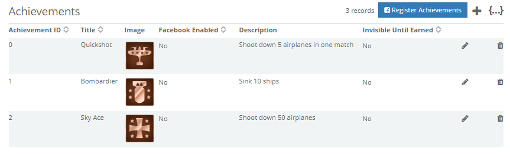
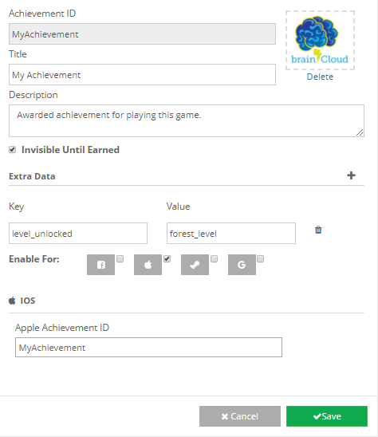
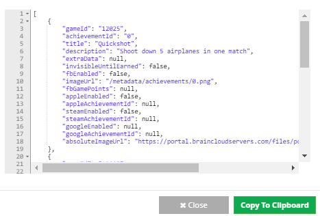

Reward your players with \[su\_tooltip style="blue" position="north" shadow="yes" close="no" behavior="hover" content="Accolades awarded to your users for accomplishments they made by using your app."\]_Achievements_\[/su\_tooltip\].

Achievements can be triggered directly from the client via API calls or can be awarded automatically by the server by configuring Milestones and Level Up rewards.

Achievements used in the [brainCloud Bombers](https://getbraincloud.com/apidocs/tutorials/unity-tutorials/braincloud-bombers-example-game/) Unity example.

* * *

To create an achievement, go to the Achievements page on the \[su\_tooltip style="blue" position="north" shadow="yes" close="no" behavior="hover" content=" The web dashboard where you set up and configure your app details on brainCloud."\]**[_dashboard_](https://portal.braincloudservers.com/admin/dashboard?custom=null#/development/gamification-achievements)**\[/su\_tooltip\].

**On the Achievements page**

- Click the **\[Add Item\]** button with the plus icon.
- Enter an \[su\_tooltip style="blue" position="north" shadow="yes" close="no" behavior="hover" content="A unique text identification for the achievement. ex. achievement\_001"\]_achievementId_\[/su\_tooltip\], title, and description.
- Upload a picture for your achievement.
- Choose if achievement is \[su\_tooltip style="blue" position="north" shadow="yes" close="no" behavior="hover" content="Used if you want to keep some spoiler related achievement hidden from your users, or to surprise them with some unexpected accomplishments."\]_invisible until earned_\[/su\_tooltip\].
- Add \[su\_tooltip style="blue" position="north" shadow="yes" close="no" behavior="hover" content="Extra data is given as JSON when calling the achievement via your app. ex. {'my' : 'data'}"\]_extra data_\[/su\_tooltip\] that is needed by your app.
- Select which platforms the achievement is enabled for.
    - For each platform your supporting, you need to add the matching achievementId you will find on the dashboard of those platforms.
- **\[Save\]** your new achievement!

Create as many achievements as your app requires.

You can review the JSON return on the achievements by clicking on the **\[Raw JSON Data\]** button.

Achievements can be edited and deleted with the **\[Edit\]** and **\[Delete\]** buttons respectively to the right of each created achievement.

**Code below**

* * *

  
Now that you created achievements, you will want to reward them to your players.

**In your client code**

- Add the brainCloud client to your app
- Pair the client with the dashboard
- Authenticate your user into brainCloud
- Request a list of achievements with the ReadAchievements call
- Award the achievements with the AwardAchievements call
- Review other achievement related calls for your app in the [API Reference](https://getbraincloud.com/apidocs/apiref/?csharp#capi-gamification-awardachievements)

using UnityEngine;

public class BCConfig : MonoBehaviour {

    private BrainCloudWrapper \_bc;

    public BrainCloudWrapper GetBrainCloud()
    {
        return \_bc;
    }   

    void Awake ()
    {
        DontDestroyOnLoad(gameObject);
        \_bc = gameObject.AddComponent<BrainCloudWrapper>();

        \_bc.WrapperName = gameObject.name;    // Optional: Set a wrapper name
        \_bc.Init();      // Init data is taken from the brainCloud Unity Plugin     

bool includeMetaData = false;
SuccessCallback successCallback = (response, cbObject) =>
{
    Debug.Log(string.Format("Success | {0}", response));
};
FailureCallback failureCallback = (status, code, error, cbObject) =>
{
    Debug.Log(string.Format("Failed | {0}  {1}  {2}", status, code, error));
};

\_bc.GamificationService.ReadAchievements(includeMetaData, successCallback, failureCallback);

string\[\] achievements = { "EGG\_ACH09", "EGG\_ACH10" };
SuccessCallback successCallback = (response, cbObject) =>
{
    Debug.Log(string.Format("Success | {0}", response));
};
FailureCallback failureCallback = (status, code, error, cbObject) =>
{
    Debug.Log(string.Format("Failed | {0}  {1}  {2}", status, code, error));
};

\_bc.GamificationService.AwardAchievements(achievements, successCallback, failureCallback);

    }
}
