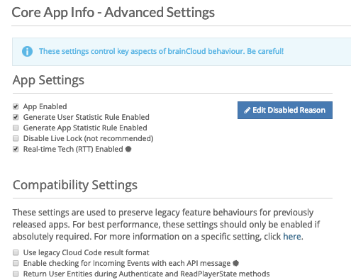
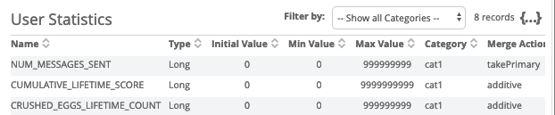
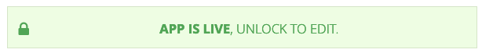
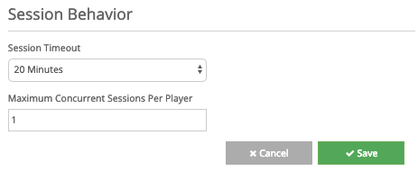

Various miscellaneous settings for your brainCloud app can be set in Advance Settings.

These settings control key aspects of brainCloud behavior. Be careful with them!

* * *

#### Choosing Core App Settings

- App Enabled
    - Disabling your app will prevent your users from making API calls. _You can still access your app from the dashboard and making API call and configuration edits._
    - Use this option if you have outstanding reasons to disable your app, such as taking your app down for temporary maintenance.
    - The disabled reason will be returned as JSON when your customers try to access your app.

 {
  "status\_message": "Processing exception (bundle): App is disabled.",
  "reason\_code": 40330,
  "severity": "ERROR",
  "disabledReason": {
    "message": "MyApp is disabled for maintence from 6:00-8:00 UTC. Please return later."
  },
  "status": 403
}

- Generate User Statistic Rule Enabled and Generate App Statistic Rule Enabled
    - These two toggles will allow if new statistics can be created via API calls. If you wish for statistics to only be manually created via the dashboard in the **[Design | Statistic Rules](https://portal.braincloudservers.com/admin/dashboard#/development/stats-player)** section, keep these toggles disabled

_Will you only create your stats on the dashboard? If so, keep this toggle off to lock down how stats can be made_

- Disable Live Lock (not recommended)
    - The Live Lock will prevent your development team from making accidental changes in the app unless they have the permission levels to unlock the Live Lock to make their changes. _Click on the Live Lock banner to temporary disable the lock._
    - Disable this option with caution

- Real-time Tech (RTT) Enabled
    - This toggle controls whether or not RTT is enabled in your app.
    - The RTT features have a unique pricing model, find out more in the ["How does RTT pricing work?"](http://help.getbraincloud.com/general-questions/how-does-rtt-pricing-work) help article.

#### Your App's Compatibility Settings

Serval features have been added and modified to brainCloud over the course of its development, and we continue to grow to the service.

Our development team prides itself on not breaking reliant apps by one of these changes. We recommend and encourage developers to keep up to date on our latest libraries, however, we will create Compatibility flag for any breaking change, and automatically grandfather in existing apps to keep using the old features. Your development team can update at there own pace.

To understand what each compatibility flag does, find more on our [Compatibility Settings](/apidocs/api-modules/compatibility-settings/) page.

First time creating an app on brainCloud? Then none of these Compatibility Settings will be relevant to your current app, but know your current app will be secure in future changes :)

  

#### Session Behavior

- Use **Session Timeout** to control how long it takes for your users to timeout of brainCloud. Your app will keep the brainCloud session alive as long as the user is playing your app, however, if the customer were to disable your app, the session timeout limit would then apply. _For example, they would have 20 minutes to return to your app before they would have to reauthenticate their session. If applicable, you could decrease the session timeout to reduce to risk of someone who is not your user from using their profile._

{
  "status\_message": "Session expiry exception (bundle): user session has expired: 9htmpnjs1fo7ujfdhq4bu5o2t6",
  "reason\_code": 40303,
  "severity": "WARNING",
  "status": 403
}

- The **Maximum Concurrent Sessions per Player** controls how many sessions a user can create at the same time. The older sessions will be invalidated for the newer sessions. _If you are making a game, you will probably want to limit one session per user to prevent cheating. However, if you are making an app, you may not see any reason to limit how many copies of your app your consumer could be running._

{  
   "status\_message":"Processing exception (bundle): User session logged out by other login",
   "reason\_code":40356,
   "severity":"ERROR",
   "status":403
}
