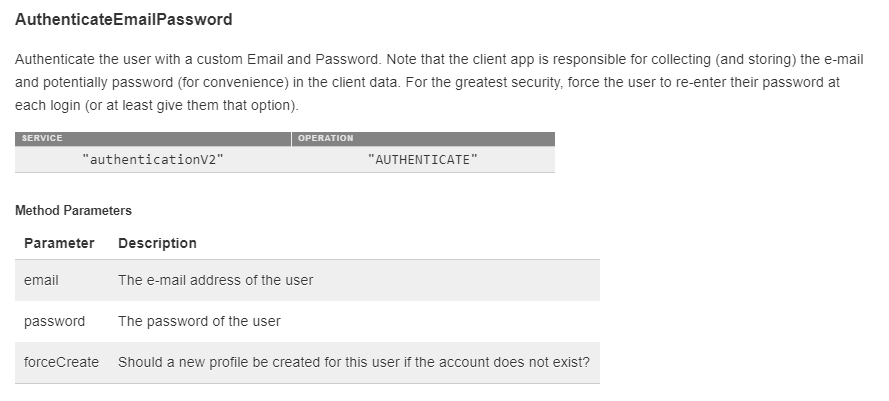

When getting started with brainCloud, the API Explorer is one of the best pages to start on. It allows you to run API calls as if your a user using your app, without having to write any code!

The API Explorer simulates a client application talking to the brainCloud servers. So you will be able to test the various APIs and confirm their behaviors and JSON return formats.

_Using the API reference to run various API calls on brainCloud._

* * *

To get started, find the API Explorer on the [_**dashboard**_](https://portal.braincloudservers.com/admin/dashboard#/development/serverscripts-apitest).

The first call you are going to run on on your App is the [Initialize](/apidocs/apiref/#wrapper-initialize) call, to pair your app client with your app on brainCloud. Since your already in the context of your app from your dashboard, you need to perform the next step you user would, Authentication.

#### API Explorer

- Choose the Service and Operation you wish to run. As mentioned earlier, you will always start with the **Authenticate** service and the **Authenticate** operation to first create a session. Click **\[Run\]** to authenticate
- After you Authenticate, the Profile ID and Session ID values will be filled in with the user's profileId and sessionId values connected to that authentication.
- The \[su\_tooltip style="blue" position="north" shadow="yes" close="no" behavior="hover" content="If you have the need to disable your app to fix a critical bug, you can use this check to give yourself access to API calls via the API Explorer."\]**_Bypass App Enabled check_**\[/su\_tooltip\] will allow you to continue to run API calls should you have disabled your app on the **Design | Core App Info | Advanced Settings** page.

For each selected Operation, you would see a **description** of what the service does, along with an API Reference link.

Below that are the parameters the API call takes.

Wow! Authentication takes a lot of parameters. Don't worry, if you clicked on that **View API** link seen in the description, you will see in your client code, the API calls are much more streamlined and cleaned up. This authentication call in the API explorer shows what the raw server takes.

_Screen capture from the API Reference, where the Authenticate call only takes three parameters._  

> _Did you know? You can click on the link in the Profile Id to go directly to the user monitoring page for that user._

* * *

#### After Authentication

Okay, your are authenticated.

- Go to the **Entity** service and **CreateEntity** operation, which will allow you to create data objects connected to the current user profile.
- Change the **entityType** parameter value to **myEntityType**. Example:

_JSON response of running GetEntitiesByType_

{
  "entityType": "myEntityType",
  "data": {
    "street": "1309 Carling"
  },
  "acl": {
    "other": 0
  }
}

- Now click **\[Run\]**!
- After running, you will see the JSON response from the server on the right of the screen of the object you just created. Click run a few more times to create additional objects.
- Now change the operation to **GetEntitiesByType**, and change the entityType parameter to myEntityType. Run it again.
- See all the entities you made now appear in a list? Copy one of the **entityId** values, and change the operation to **DeleteEntity**
- Enter your copied entity id as the entityId value in parameters, and run it one final time.

* * *

You authenticated as a user, created several entities, queried them from the server, and deleted one!

Try other aspects of the API Explorer to try out the API. Reference these docs and the API reference to gain additional understanding on how to use each service and operation!
