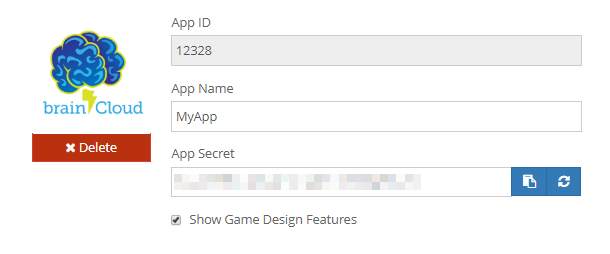

Key application identifiers. These identifiers are used when connecting your **client** to brainCloud, or for allowing brainCloud to connect to other **third-party services.**

Without these identifiers, you will not be able to pair your client app to your app on brainCloud. Be sure to keep your app identifications a secret

_Example of using the brainCloud plugin in Unity to automatically connect your appId and appSecret to your code base_

* * *

To see and edit your application ids, go to the Application IDs page on the \[su\_tooltip style="blue" position="north" shadow="yes" close="no" behavior="hover" content=" The web dashboard where you set up and configure your app details on brainCloud."\][dashboard](https://portal.braincloudservers.com/admin/dashboard?custom=null#/development/core-settings-information)\[/su\_tooltip\].

#### Pairing your app's identifiers

- Your **App Id** is your app's unique identification on brainCloud. No other app shares your app id, and it cannot be changed
- For your **App Name**, you can enter whatever value desired. Your customers will not see this value, so you could name one app "MyApp \[Dev\]" and another as "MyApp \[Live\]," to denote the \[su\_tooltip style="blue" position="north" shadow="yes" close="no" behavior="hover" content="No one likes to break live code. It's recommended to keep a development version of your app on release, to test new features and changes in a 'safe to break' environment."\]_**production and internal**_\[/su\_tooltip\] versions of your apps.
- Similar to your app name, your app's image is an internal picture that can be whatever you like to help represent your app on brainCloud. The example screenshot uses a brainCloud logo as the picture.
- Your **App Secret** is used to ensure the connecting being made to brainCloud belongs to your app.
- The **Show Game Design Features** controls whether gamification features like Achievements and Leaderboards show up on the brainCloud UI. You can uncheck this box to help clean up the UI, and re-enable the box should you decided to add these features at a later date.

If your app secret is ever leaked, it can be refreshed with the \[**Regenerate App Secret**\] button. Please note you must click **\[Save Changes\]** for the new secret to be saved.

Accidentally saved over your current app secret? You can enter a copy of your old secret into the App Secret box, and save your old secret. You can change your secret to any text value, however, a secure GUID, like the ones generated by the **\[Regenerate App Secret\]** button, is highly recommended.

When using features that require brainCloud to pair with other dashboard, you will have to enter those platforms associated idenitifiers in the Configure Platform section.

**Code below**

* * *

Now that you have access to your ids, let's pair your app with brainCloud.

string serverUrl = "https://sharedprod.braincloudservers.com/dispatcherv2";
string secret = "1234-1234-1234-1234";
string appId = "123456";
string version = "1.0.0";

\_bc.Init(serverUrl, secret, appId, version);

That's it, your app is paired with brainCloud by using your app id and secret. See the [Initialize](/apidocs/apiref/#wrapper-initialize) method in the API Reference for additional information and examples of other programming languages.

_If you are using the brainCloud Unity plugin, you only need to call \_bc.Init(). The app id and app secret will be auto-filled from the plugin. See further instruction on_ [_GitHub_](https://github.com/getbraincloud/braincloud-csharp/blob/master/README.md)
