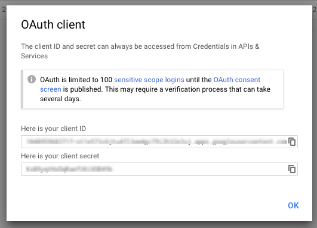

# App Creation

## Step 1

Go to the Google Play Console and create your app:  
[https://play.google.com/apps/publish/](https://play.google.com/apps/publish/)

_Fill in the rest of the page as required._

## Step 2

With your app selected, navigate to **Services & APIs** section of the left sidebar.

Click the **\[USE GOOGLE PLAY GAME SERVICES IN THIS APP\]** button.

Click **\[Add New Game\]**, and enter the _name_ of _type_ of the app

## Step 3

Go to the **Google Cloud Console** ([https://console.cloud.google.com](https://console.cloud.google.com)) and select your app from the drop-down at the top of the page.

If you don't see your app, ensure you're on the All tab, or search for the app's name

### Step 4

In the left-hand menu, choose **APIs & Services > Dashboard**

You should see that Google Play Game Services is enabled, along with some other stock services.

If you don't see Google Player Services, click **\[ + ENABLE APIS AND SERVICES \]** and enable it.

Now in the Google Cloud Console Window, under **APIs & Services** choose **Credentials**

Click the **OAuth** Consent tab.

- Set the **Application Name**
- Set the **Support Email**
- Set the Privacy policy URL. You do not have to do this for development, but you will run into problems if you don't add one in production!
- Fill in any other required fields
- Hit **\[ Save \]**

Click the **Credentials** tab

- Click the **\[ Create Credentials \]** drop-down, and choose "**OAuth client ID**" option
- Choose **"Web Application"** as the **Application type**
- Give it a name - maybe "brainCloud web access"
- Click **\[ Create \]**

This will give you a **client Id** and **client secret**.

## Step 5

- Go to your app in the **brainCloud Portal**: [https://portal.braincloudservers.com/](https://portal.braincloudservers.com/)
- In **Design | Core App Info | Application Ids** > Select the **Google** Tab in "Configure Platforms"
- Enter the **Google Client Id** and the **Google Client Secret**.
- Enter the **Google App Id** (the numbers right before the dash in the Google Client Id)
- Enter the **Google Package Name**

## Step 6

Back on the Google Cloud Console "Credentials" tab

- Click **"Create credentials"** > **"Service account key"**
- For **Service account**, select "**New Service Account**"
- Give it a **name**, and an "**Owner**" role <- probably **Project | Owner**
- For **Key type**, select "P12"
- Click **\[ Create \]**

Keep that P12 Key!

## Step 7

On that same page...

- Click "**Manage Service Accounts**"

You should see your new service account on this page, and have a P12 file saved locally from earlier

- Copy the Service Account **Email** - eg.  "authentication@authencation-69372532.iam.gserviceaccount.com"
- Go back to the brainCloud Portal, **Design | Core App Info | Application Ids** page - **Google Tab** under _Configure Platforms_
- Enter the **Google Service Account Email** that you had copied
- Click "Select a certificate file" and add the saved P12
- Save your changes!

# Create a KeyStore

Create a key store. View this document to find out how: [https://developer.android.com/studio/publish/app-signing.html](https://developer.android.com/studio/publish/app-signing.html)

Now in the Google Cloud Console Window, go to APIs & Services > Credentials

- Click "Create Credentials" > "OAuth client ID"
- Select "Android" as Application type (this will be used to pair your app with Google Play Services!)
- Give it a name
- Enter your SHA1 from your keystore. To get the SHA1, use the listed command on your saved keystore  
    ex. keytool -exportcert -keystore authentication-shared.keystore -list -v
- Enter the package name you defined earlier  
    ex. com.brainCloud.Authenication

Then in Game Services of the Google Play Console

- Select your app
- Select "Linked Apps" on the left sidebar
- Click Android
- Enter your package name
- Click "Save and Continue"

It should say it has been successfully linked, and display your client id.

Use this paired keystore when signing your app in the "Configuring Google Play Services in Code" section

# Enabling Testers

If you set up your app like above, you may still run into problems with the Google Auth. This is because testers need to be enabled on the Google Play Console

In Game Services of the Google Play Console

- Select your app
- Select "Testing" on the left sidebar
- Click "Add Testers"
- Add the email addresses associated with the Google Play accounts you plan to test with

If you skip this step, you may see the Google Play popup on authentication with your android device, but while your app is in development, you will get not the Google Tokens needed to authenticate.

# Configuring Google Play Services in Code

Get the Unity Package from this GitHub repo, and follow the instructions: [https://github.com/playgameservices/play-games-plugin-for-unity](https://github.com/playgameservices/play-games-plugin-for-unity) 

The above link will inform you to create an achievement on the Google Play Console, so you can export a similar XML example to pair the plugin with.

<?xml version="1.0" encoding="utf-8"?> <!-- Google Play game services IDs. Save this file as res/values/games-ids.xml in your project. --> <resources> <!-- app\_id --> <string name="app\_id" translatable="false">1074452757487</string> <!-- package\_name --> <string name="package\_name" translatable="false">com.brainCloud.Authentication</string> <!-- achievement Welcome --> <string name="achievement\_welcome" translatable="false">CgkI7\_f\_0qIfEAIQAw</string> </resources>

In Unity's Player Settings for Android, you'll need to add the keystore file and package name created earlier.

You can see our GitHub Authentication project example for reference.  
[https://github.com/getbraincloud/UnityExamples/tree/master/Authentication](https://github.com/getbraincloud/UnityExamples/tree/master/Authentication)

_Note that because of the Enabling Testers step, you will not be able to authenticate with brainCloud Authenticate example, as is._ You will need to alter the current setup for your own test app.

You'll be able to log in via Google Play Services and brainCloud with the following code

if (GUILayout.Button("Google Signin + brainCloud Authenticate", GUILayout.ExpandWidth(false)))
            {
                PlayGamesClientConfiguration config = new PlayGamesClientConfiguration.Builder()
                    .RequestIdToken()
                    .RequestServerAuthCode(false)
                    .Build();
                
                PlayGamesPlatform.InitializeInstance (config);
                PlayGamesPlatform.Activate().Authenticate((bool success) => {

                    if (success)
                    {
                        m\_googleId = PlayGamesPlatform.Instance.GetUserId();
                        m\_serverAuthCode = PlayGamesPlatform.Instance.GetServerAuthCode();    
                        
                        BrainCloudWrapper.GetInstance().AuthenticateGoogle(m\_googleId, m\_serverAuthCode, true, OnSuccess\_Authenticate, OnError\_Authenticate);
                    }
                    else
                    {
                       // Handle Error State
                    }
                });
            }
