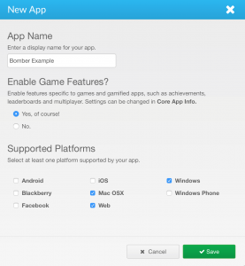
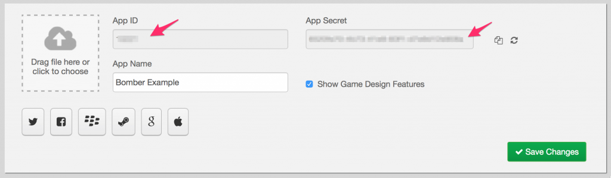
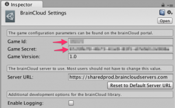
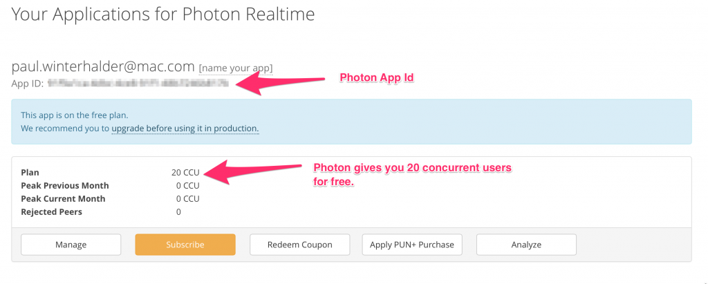
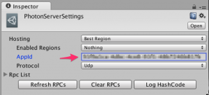
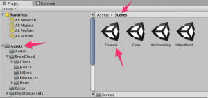

_Note - these instructions assume that you've already made yourself familiar with the game via the Intro and Overview postings._

To build the **Photon** version of brainCloud bombers:

- Step 1: Retrieve the source code
- Step 2: Register with brainCloud (if you haven't already)
- Step 3: Create the brainCloud Bombers app
- Step 4: Update the brainCloud appId and secret in the source code
- Step 5: Import the brainCloud Bombers meta-data
- Step 6: Register with Photon
- Step 7: Update the Photon appid and secret
- Step 8: Build!

**_To build the UNET version of Bombers, just use UNET Step 6 and UNET Step 7._**

* * *

### Step 1: Retrieve the source code

The brainCloud Bombers source is stored on GitHub.  You can find it in the "Bombers" directory [here](https://github.com/getbraincloud/UnityExamples).

### Step 2: Register with brainCloud

Registering with brainCloud is easy and free.  Go to [getBrainCloud.com](http://getbraincloud.com) and click **\[Sign Up\]** in the top-right-hand corner.

### Step 3: Create the brainCloud Bombers App

To create the app:

- Go to the **Administration** section of the Portal by clicking on the "Gear" icon in the top-right
- Click on the **\[+\]** button in the "Your Apps" section of the **Home** page
- Fill out the **New App** dialog - be sure to enable game features and choose the platforms to run upon.

New App Dialog

- Go to the app by clicking on its name in the **Your Apps** list, or by choosing the **Design** tab, and then selecting it from the drop-down
- You'll see the brainCloud App ID and App Secret on the **Core App Info | Application IDs** page....  we'll use those in our next step.

### Step 4: Update the brainCloud appId and secret in the source code

- Load the bomber project, "PhotonDemo", into Unity
- Choose **brainCloud | Settings** from the Unity menu bar
- Enter the _brainCloud app id_ into the _Game Id_ field
- Enter the _brainCloud secret_ into the _Game Secret_ field
- Also, hit **\[Reset to Default Server URL\]** to ensure that the client is set to connect to the proper endpoint

### Step 5: Import the Bomber meta-data

- Back in the brainCloud portal, go to **Design | Admin Tools** for the your app
- Click the \[Import\] button in the Configuration Data section
    - Choose **\[Select Configuration File (bcconfig)\]**, and navigate to the **_Bombers/ImportData/Bombers\_<some\_date>.bcconfig_** file included with the bomber source
    - You can leave the two "Do not overwrite" options blank - they're not used in this example
    - Click **\[Upload\]** to import the data
    - You'll immediately note that the brainCloud Bombers icon is now associated with your project.  You'll also see user statistics, achievements, and XP levels filled in throughout the application.

### Step 6: Register with Photon

- Go to **https://www.exitgames.com/en/PUN** to set up a free Photon account
- Once you've registered, click **\[Dashboard\]** to view the free app that Photon has automatically configured for you
- You'll notice the Photon App ID - we'll be using that in the next step

### UNET Step 6: Register with UNET

- Go to [**https://www.unet.cloud.unity3d.com**](http://unet.cloud.unity3d.com) to set up a free Unity Cloud account
- Once you've registered, click **\[Multiplayer\]** at the top left and click the \[Create Project\] button at the top right
- Type in a name, a maximum number of players per room, and accept
- Copy the **UPID** field from this page

### Step 7: Update the Photon app id

- Back in Unity, Choose **Window | Photon Unity Networking | Local Settings Asset** from the drop-down menu
- In the Inspector windows that shows, enter the Photon AppID

### UNET Step 7: Update the Cloud Project ID

- Back in Unity, Choose **Edit | Project Settings | Player** from the drop-down menu
- In the Inspector windows that shows, enter the you **UPID** into the **Cloud Project Id** field

### Step 8: Play the game!

- From the **Project** window, choose the **Assets** folder on the left, and then choose the Scenes subfolder
- Select the **Connect** Scene in the **Assets** folder of the project, and then click **Play!** Have fun!

