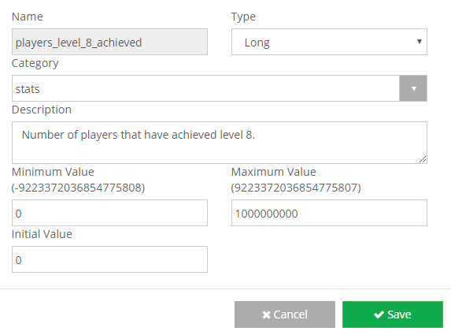

Statistics that are global to your app.

Can be used to track sales, the number of total users completing certain tasks, global milestones, etc.

**On the Global Statistics page**

- Click the **\[Add Item\]** button with the plus icon.
- Enter a name, type, category, and description.
- Set the min value, max value, and the initial value.
- **\[Save\]** your new global stat!
