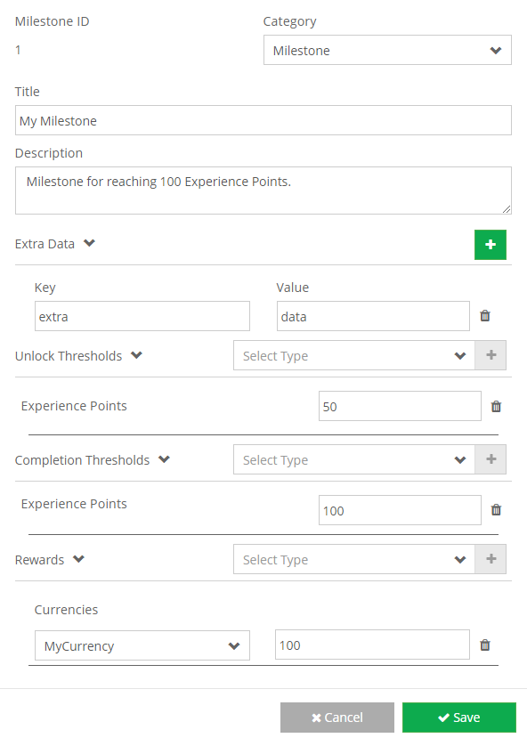

Reward your players with \[su\_tooltip style="blue" position="north" shadow="yes" close="no" behavior="hover" content="Goal posts your users reach from culimative activity in your app."\]_Milestones_\[/su\_tooltip\].

Milestones are automatically completed by users of your app reaching a certain stat or level threshold.

**On the Milestones page**

- Click the **\[Add Item\]** button with the plus icon.
- Enter a category, title, and description.
- Add extra data that is needed by your app.
- Enter the unlock thresholds required.
- Enter the completion threshold required.
- Add rewards that are given after the milestone is completed.
- \[Save\] your new achievement!
