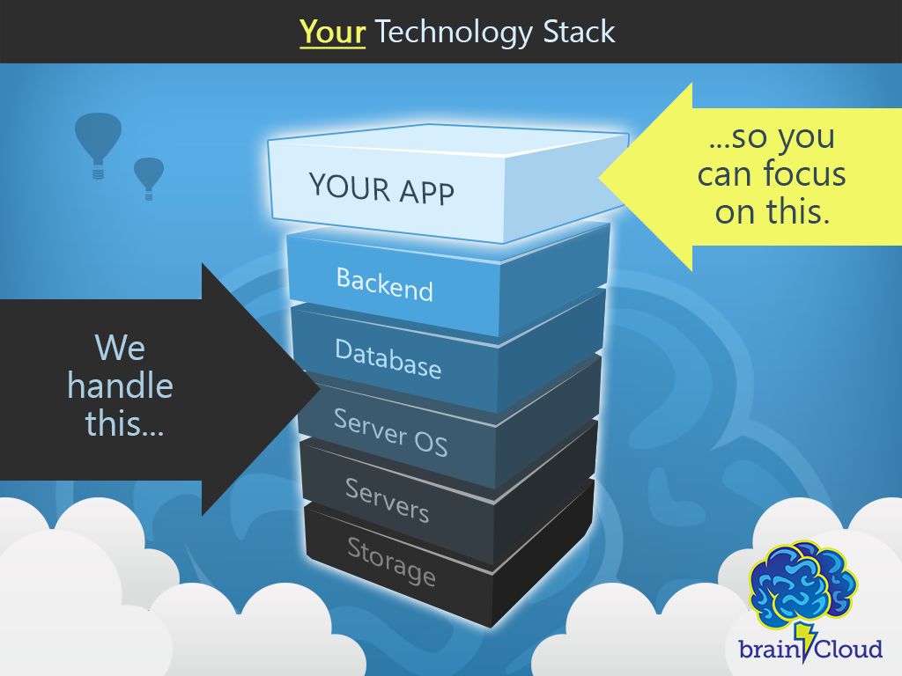

## Welcome

Welcome to the [brainCloud BaaS](http://getbraincloud.com) documentation.  Here you will find the latest details on developing with brainCloud - including feature overviews, how-to's, [API references](/apidocs/api-reference-new/) and video tutorials.

brainCloud has a very broad feature-set - you can use as much or as little of it as you like!

## 

The brainCloud Docs are organized as follows:

- [**Introduction**](https://getbraincloud.com/apidocs/introduction-2/ "Introduction") - introduces the key concepts that are important to understanding the workings and organization of the APIs
- **[Key Concepts](https://getbraincloud.com/apidocs/api-reference-new/)** - key concepts that programmers will need to understand
- **[Client Libraries](https://getbraincloud.com/apidocs/client-libraries/)** \- links to the client libs
- [**API Reference**](https://getbraincloud.com/apidocs/apiref/#capi-auth) - usage details for the API methods themselves (now in a separate [doc!](https://getbraincloud.com/apidocs/apiref/#introduction))
- **[Cloud Code Central](https://getbraincloud.com/apidocs/cloud-code-central/)** \- cloud code tips and examples
- [**Portal Tutorials**](https://getbraincloud.com/apidocs/portal-usage/) - how to use the Design Portal
- [**SDK Tutorials**](https://getbraincloud.com/apidocs/tutorials/) - tutorials on various aspects of the API
- **[Support](https://getbraincloud.com/apidocs/support/)** - answers to frequently asked questions
- **[Release History](https://getbraincloud.com/apidocs/releases/)** - view the latest platform updates

_We're continuously improving our documentation - so be sure to check back often.  And if you can't find what you're looking for - don't hesitate to reach out by clicking the green **Help** widget on any of our pages._

_**Using Unity?**_ _Be sure to check out our [Unity Tutorials](https://getbraincloud.com/apidocs/tutorials/unity-tutorials/) and our [brainCloud Bombers](https://getbraincloud.com/apidocs/tutorials/unity-tutorials/braincloud-bombers-example-game/) example game!_

## Not registered yet? What are you waiting for?!!

To get started, all you need to do is:

- [Register](https://portal.braincloudservers.com/signup#/ "Register") - it's free! \*
- [Download](https://getbraincloud.com/apidocs/client-libraries/ "Download Client Libs") your preferred SDK
- Get coding!  Good luck!

\* Free during development, and super reasonably priced thereafter.  Details on our [pricing](http://getbraincloud.com/pricing-overview/) page.
