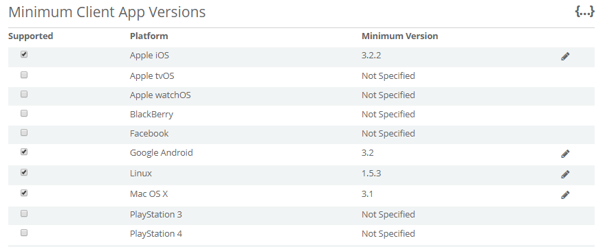
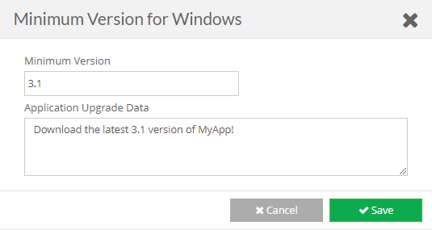

Need to temporarily disable connection to iOS users while a critical bug is fixed? Need to ensure everyone updates to the new major 3.0 patch to prevent older versions from corrupting current data?

Then this page is for you. You _choose_ which platforms your app supports and which versions of your app from these settings.

_Example of an apps possible platform settings_

* * *

#### Configuring your app platforms

- To control which platform that can make API calls against your app, simply check each **Supported** platform.
- When forcing a minimum version for your app, click the \[**Edit\]** button for a supported platform and enter the **Minimum Version** and the \[su\_tooltip style="blue" content="Depending on what your environment supports, you could attach plain-text instructions to display, automatically update your app based on a download link to the new version."\]**_Application Upgrade Data_**\[/su\_tooltip\].
- Now, whenever one of your customers makes a call brainCloud from your app, they will be safely blocked and your app will handle the updating.

Note that depending on your app, you may never need to continuously force users to update. If you do not need to do so, you will not be using the minimum version feature. If making a multiplayer game, you will most likely need to use this feature at some point.

**Code below**

* * *

You are now blocking certain customers from using your app based on their platform. You need to handle informing them to update to the latest version.

The response from the server from an invalid platform would look like so:

{
  "status\_message": "Processing exception (message): App version 1.5.0 for appId 12328 is obsolete.",
  "reason\_code": 40322,
  "upgradeAppId": "Your version of MyApp is out of date. Please update the app from the Apple Store to try out the new features!",
  "status": 400
}

Here is an example of parsing that JSON after an authentication.

\_bc.AuthenticateUniversal(username, password, forceCreate, OnSuccess\_Authenticate,
 (status, code, error, cbObject) => {

  if (code == ReasonCodes.GAME\_VERSION\_NOT\_SUPPORTED) {
   Dictionary<string,object> jsonError = (Dictionary<string,object>) JsonFx.Json.JsonReader.Deserialize(error);
   string status\_message = jsonError\["status\_message"\].ToString();
   Debug.Log(status\_message);
   string upgradeAppId = jsonError\["upgradeAppId"\].ToString();

   //TODO: Handle informing the user that they need to upgrade their app. 
   //Such as via a popup, or automatically handling the new version download.
   Debug.Log(upgradeAppId);
  }
 });

You will need to handle this error case in the way your app requires.
