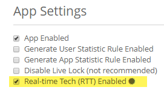

Online Presence allows an app's users to know which of their friends are currently online, what they are doing, and whether they are available to interact.

Presence activity of friends on the Main Menu of the brainCloud Bombers

To enable Presence, you must first enable [RTT](/apidocs/introduction-2/braincloud-rtt/) on the **Design | Core App Info | Advanced Settings** page. Check **Real-time Tech (RTT) Enabled**.

After enabling RTT for your app, go to the Presence Config page on the \[su\_tooltip style="blue" position="north" shadow="yes" close="no" behavior="hover" content=" The web dashboard where you set up and configure your app details on brainCloud."\]**_[dashboard](https://portal.braincloudservers.com/admin/dashboard?custom=null#/development/gamification-achievements)_**\[/su\_tooltip\].

**On the Presence page**

- Check **Enable Presence**.
    - As mentioned above. Must first enable RTT.
- Check whether your app uses Allow invisibility and Support rich activity.
- Enter the supported Max content size (bytes).
- Check whether your app uses Real-time Tech (RTT) updates.
- **\[Save\]** the changes to your Presence Config!

**Code below**

* * *

  
Now that you activated Presence, you will want to use it in your app.

**In your client code**

- Add the brainCloud client to your app
- Pair the client with the dashboard
- Authenticate your user into brainCloud
- Request a list of achievements with the ReadAchievements call
- Award the achievements with the AwardAchievements call
- Review other achievement related calls for your app in the [API Reference](https://getbraincloud.com/apidocs/apiref/?csharp#capi-gamification-awardachievements)

using UnityEngine;

public class BCConfig : MonoBehaviour {

    private BrainCloudWrapper \_bc;

    public BrainCloudWrapper GetBrainCloud()
    {
        return \_bc;
    }   

    void Awake ()
    {
        DontDestroyOnLoad(gameObject);
        \_bc = gameObject.AddComponent<BrainCloudWrapper>();

        \_bc.WrapperName = gameObject.name;    // Optional: Set a wrapper name
        \_bc.Init();      // Init data is taken from the brainCloud Unity Plugin     

bool includeMetaData = false;
SuccessCallback successCallback = (response, cbObject) =>
{
    Debug.Log(string.Format("Success | {0}", response));
};
FailureCallback failureCallback = (status, code, error, cbObject) =>
{
    Debug.Log(string.Format("Failed | {0}  {1}  {2}", status, code, error));
};

\_bc.GamificationService.ReadAchievements(includeMetaData, successCallback, failureCallback);

string\[\] achievements = { "EGG\_ACH09", "EGG\_ACH10" };
SuccessCallback successCallback = (response, cbObject) =>
{
    Debug.Log(string.Format("Success | {0}", response));
};
FailureCallback failureCallback = (status, code, error, cbObject) =>
{
    Debug.Log(string.Format("Failed | {0}  {1}  {2}", status, code, error));
};

\_bc.GamificationService.AwardAchievements(achievements, successCallback, failureCallback);

    }
}
