#### As soon as **April 11, 2019**, GCM (Google Cloud Messaging) will be removed by [Google](https://developers.google.com/cloud-messaging/).

#### We suggest to check out Google's [FCM (Firebase Cloud Messages)](/apidocs/portal-usage/push-notification-setup-firebase/) instead.

 

* * *

**\[LEGACY TUTORIAL\]**

 

In this tutorial we walk you through the steps to configure Google Cloud Messaging (GCM) with brainCloud.

## Prerequisites

- Must have a Google developer account
- Must have created an app on the [Google developer console site](https://console.developers.google.com/)
- Must have entered appropriate Google information in "Core App Info | Application IDs" seciont of the brainCloud portal

 

## Create GCM API key for brainCloud

### Enable the GCM API

- Navigate your browser to the [Google developer console site](https://console.developers.google.com/)
- Select your app [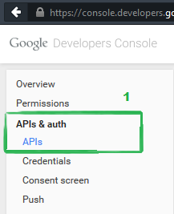](/apidocs/wp-content/uploads/2015/07/GooglePlay1.png)
- Click the "APIs & auth | APIs" link on the left hand nav bar [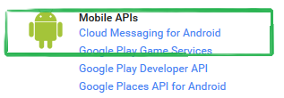](/apidocs/wp-content/uploads/2015/07/GooglePlay1-2.png)
- Select "Cloud Messaging for Android
- Enable the API

### Create Public Access Key

- - Navigate to the "API | Credentials" page
    - Create New Key under "Public API access"
    - Select "Server Key" [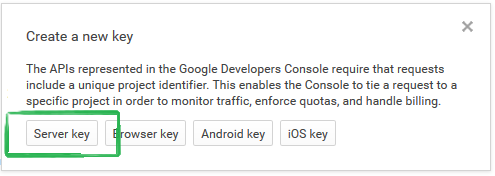](/apidocs/wp-content/uploads/2015/07/GooglePlay31.png)
    - Hit the Create button [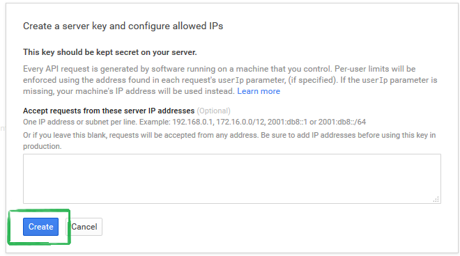](/apidocs/wp-content/uploads/2015/07/GooglePlay32.png)

 

- You should now have a server API key: [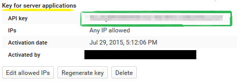](/apidocs/wp-content/uploads/2015/07/GooglePlay33.png)
- Navigate to the brainCloud portal and enter this key in the Notifications | Settings for Google Play. [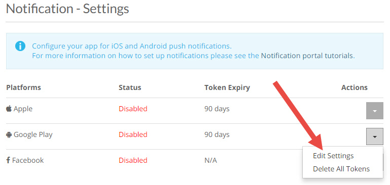](/apidocs/wp-content/uploads/2016/09/brainCloud_angNotif_1.jpg)

 

 

## Enable GCM For Your App

In addition to the above steps, you will need to do the following in order for GCM to work in your app.

### Link your Google Console game to Google Play

Apparently these two systems can't talk to each other. Do the following to establish a link between the two systems.

- Navigate to the [Google Play Developer site (play.google.com/apps/publish)](http://play.google.com/apps/publish)
- Click Game Services in left hand navigation bar [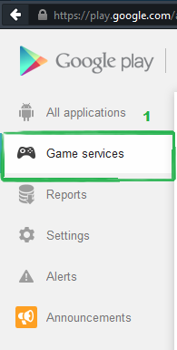](/apidocs/wp-content/uploads/2015/07/GooglePlay4.png)
- Click Add New Game button on top right
- Fill in the appropriate info in the Add Game dialog making sure to select "I already use Google APIs in my game" and using the appropriate game (Hello World is probably \*not\* the correct game). [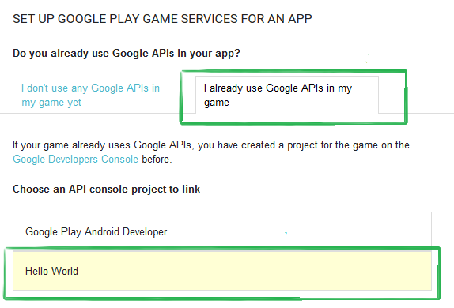](/apidocs/wp-content/uploads/2015/07/GooglePlay41.png)

 

### Registering GCM Notification Token With brainCloud

After Authenticating a user with brainCloud, you will want to Register their GCM notification token with brainCloud. Specifically you'll want to call the [BrainCloudPushNotifications.RegisterDeviceToken()](/apidocs/apiref/#capi-push-registerpushnotificationdevicetoken) and pass in the registration id. In order to get this registration id, follow these steps.

Note that this example assume you are working in Java on an Android device. For developers using Unity, follow the appropriate instructions available elsewhere.

- Find your "Sender Id" - the number which appears under your app's name in the Game Services section of the Google Play developer site. [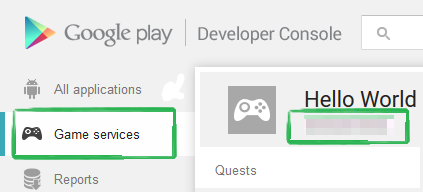](/apidocs/wp-content/uploads/2015/07/GooglePlay5__1_.png)
- This Sender Id is what you will need to pass to the GCM Java API to get a registration id. The code below shows how to retrieve the registration id: [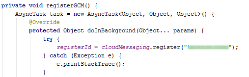](/apidocs/wp-content/uploads/2015/07/GooglePlay511.png)
- Once you have the registration id you will want to call [BrainCloudPushNotifications.RegisterDeviceToken()](/apidocs/apiref/#capi-push-registerpushnotificationdevicetoken)

## Other Google Configuration Stuff

A few other tasks remain to link credentials together etc.

### Create OAuth Key

- In the [Google Developer Console](https://console.developers.google.com) navigate to the "Apis & auth | Credentials" section
- Under the OAuth section click "Create new Client ID"
- Fill in the appropriate info [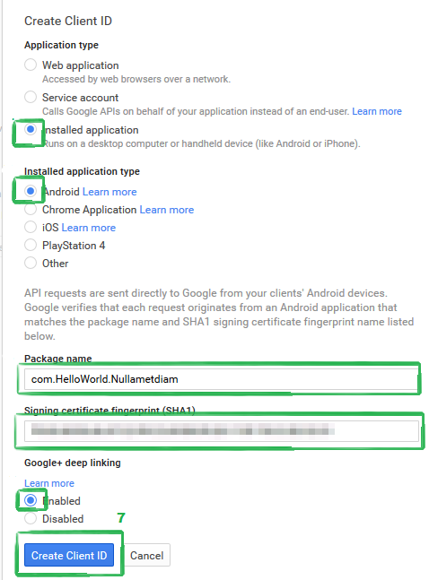](/apidocs/wp-content/uploads/2015/07/GooglePlay6.png)
-  Your Client ID should now available [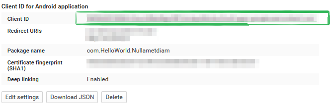](/apidocs/wp-content/uploads/2015/07/GooglePlay62.png)

### Link Client ID to Google Play

- Navigate to the [Google Play Developer Console](https://play.google.com/apps/publish)
- Select Game Services for your app from left hand navigation bar
- Click "Linked Apps" [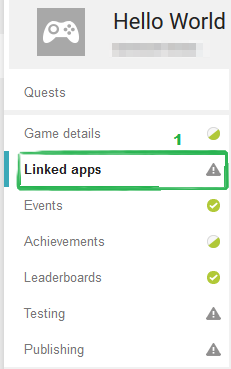](/apidocs/wp-content/uploads/2015/07/GooglePlay7.png)
- Click "Android" button
- Enter the appropriate information for your app 
- And finally, verify that your Client ID is linked in correctly [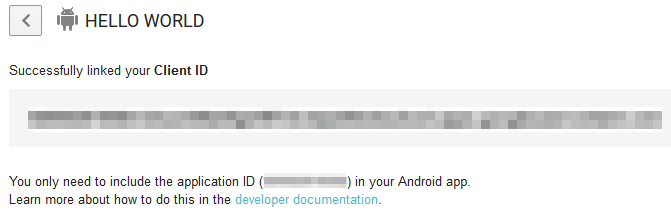](/apidocs/wp-content/uploads/2015/07/GooglePlay8.png)
- Take a breath of fresh air, you are finally \*done\*!

 

**\[LEGACY TUTORIAL\]**

* * *

#### As soon as **April 11, 2019**, GCM (Google Cloud Messaging) will be removed by [Google](https://developers.google.com/cloud-messaging/).

#### We suggest to check out Google's [FCM (Firebase Cloud Messages)](/apidocs/portal-usage/push-notification-setup-firebase/) instead.
