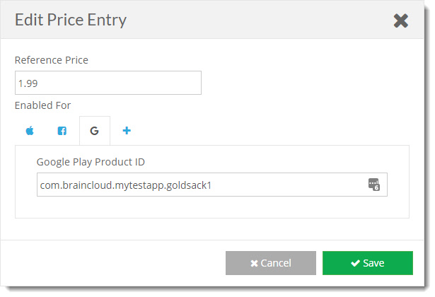
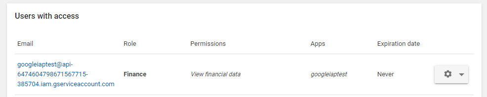
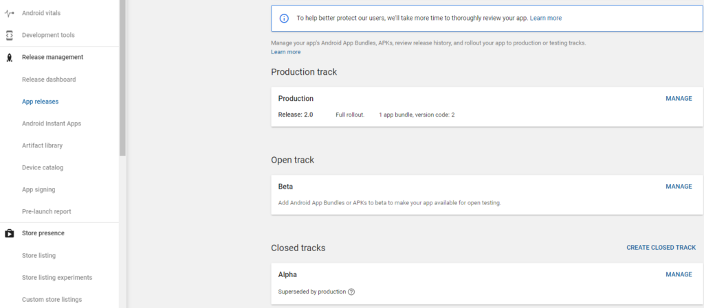

In this tutorial, we’ll look at integrating the Google Play store with the brainCloud marketplace. By doing this, Google Android users will have the ability to validate purchased items from the Google Play store with brainCloud.

Note that apps still have to make the purchase directly with the Google Play Store. For more information on this process refer to the Google Play developer site.

## Purchase Flow

(coming soon)

## brainCloud Portal Setup

Here are the steps to configure brainCloud for Google Play purchases.

Prerequisites

- You should have set up your products in the brainCloud marketplace. Please refer to the [Marketplace Configuration](/apidocs/portal-usage/marketplace-configuration/) guide.
- You should have created the Google Store In-App products per the Google Developer documentation

### Associate Google In-App Products with brainCloud Products

After setting up your products in the brainCloud marketplace, you’ll want to associate them with the Google product ids. In particular, we will be grabbing the product ids from the Google Play developer site and entering them into the appropriate brainCloud products.

- Log into the [Google Play Developer](https://play.google.com/apps/publish/) site
- Select your App and go to the “In-App Products” section
- Select your IAP and grab the Google Product ID  
    
    
    

(for this tutorial we'll assume that the product id is com.braincloud.mygame.goldsack1)

- Log into the brainCloud Portal
- Go to the “Marketplace | Products” page in the Design tab  
    
    
    
- Select the product you would like to associate with.
    
    
    

- Click the “+ Edit Product” button
    
    
    

- Find your Price (or create one) and click the edit icon
    
    
    

- In the Edit Price dialog, click the + icon to add an entry for Google
    
    
    

- Enter your Google product id for this price – in our case “com.braincloud.mytestapp.goldsack1”.
    
    
    

- At this point, you may want to select your price to be the default if it isn’t already selected. You can do this back in the Edit Product page.
    
    
    

- You can now verify that your Product is coming back with the correct Google In-app Product id. Here is the output from the API Explorer “Product.GetInventory” call using "googlePlay" as the platform:
    
    
    

### Google Certificates and Credentials

Once the products have been configured, you will need to add the appropriate Google credentials to brainCloud.

- Navigate to the Application IDs page  
    
    
    
- Click the Google icon and notice the following fields  
    
    
    
- The following sections will show you where to find the appropriate information

#### Google Package Name

- Log into the [Google Play](https://play.google.com/apps/publish/) developer site
- Select your application
- Grab the package name

#### Google Service Account Email & p12 Certificate File

To validate purchases, brainCloud requires the usage of a Service Account to communicate with the Google Play backend servers.

- Log into the [Google Console](https://console.developers.google.com) developer site
- Create a project (or select an existing project). Note that the Google Service Account can be used across multiple apps.  
    

the left top corner screen shot of Google Developer Console

(by clicking caret down icon, open the project list dialogue with select or create new project options)

- Enable the Google Play Android Developer API

- Type the name of APIs or Services

- Check Google play Android Developer API is on the list of

- Navigate to the **Home** \->**Credentials**, click \[+ CREATE CREDENTIALS\], select **Service account**

- Create a new Service Account

- Set service account permissions and click **CONTINUE**

select a role and click continue

- Select the p12 key type and click Create

create a key and select key type P12

- This should create a new Service Account and immediately download the p12 key file to your computer. If for some reason the browser did not download the p12 key file try Chrome.
- Upload the p12 key file to the brainCloud portal.
- Also, the _Service Account_ should now show up on the _Credentials_ page. Important: Grab the email address and save it to the brainCloud portal - **Design | Core App Info | Application IDs**, _Google_ platform tab, _Google Service Account Email_ field.  
    
    
    

### Linking the Google Console project to the Google Play app

For the Service Account to be active, you will need to link the console project to the Google Play app and give the Service Account permission to View Financial Reports. Note you will need to be the account owner in order to complete these steps.

- Log into the [Google Play Developer Console](https://play.google.com/apps/publish)
- Go to Settings | API Access  
    

- Select the Google Console project to link to

- Verify that the project is linked and the Games Services Publishing API access is ON  
    
    
    
- Navigate to Users & permissions

- Select the Service Account and turn on "View financial data" permission. All other permissions can be disabled  
    

- Once fill out all necessary publish information on Google play console

- And after publishing you APK with billing permission to one of the releases and set tester accordingly

- Upload the Java Keytool generated upload key to App signing section

- You should now be able to validate purchase with brainCloud.

### Confirming the purchase Client Side

After making a purchase client side, GooglePlay will return a receipt with an orderId, productId, and purchaseToken that is used by the [VerifyPurchase](/apidocs/apiref/#capi-product-confirmgoogleplaypurchase) API call.

- If your using Unity's IAP Service, your code may look like this

public PurchaseProcessingResult ProcessPurchase(PurchaseEventArgs args)
    {
        var responseDictionary = 
            (Dictionary<string, object>)JsonReader.Deserialize(args.purchasedProduct.receipt);
        var  receiptDataDictionary = 
            (Dictionary<string, object>)responseDictionary\["receiptData"\];
        
        var payloadJson = (string)receiptDataDictionary\["Payload"\];
            
        var payloadDictionary = 
            (Dictionary<string, object>)JsonReader.Deserialize(payloadJson);
            
            
        string innerPayloadJson = (string)payloadDictionary\["json"\];
            
        var innerPayloadDictionary = 
            (Dictionary<string, object>)JsonReader.Deserialize(innerPayloadJson);
            
        //brainCloud Expects a token, rather then purchaseToken. We convert that now
        innerPayloadDictionary\["token"\] = innerPayloadDictionary\["purchaseToken"\];

        var storeId = "googlePlay";
        var contentJson = JsonWriter.Serialize(innerPayloadDictionary);

          
        bc.AppStoreService.VerifyPurchase(storeId, contentJson,
            (response1, cbObject1) =>
            {
                //Award Purchased Item
                if (string.Equals(args.purchasedProduct.definition.id, "currency\_cashpack\_500",
                    StringComparison.Ordinal))
                {
                    coins += 500;
                }
                
            }, (status1, code1, error1, cbObject1) =>
            {
                // Handle failed verification
                Debug.Log("Purchase Failed"); 
            }
        );
        
        return PurchaseProcessingResult.Complete;
    }

- If using Google Play Billing Library, your code may look like this:

Java
...
        billingClient = BillingClient.newBuilder(activity).enablePendingPurchases().setListener(this).build();
        billingClient.startConnection(new BillingClientStateListener() {
            @Override
            public void onBillingSetupFinished(BillingResult billingResult) {              
                if (billingResult.getResponseCode() == BillingClient.BillingResponseCode.OK) {
                    // The startConnection() is async methods put query purchases here.
                    List<String> skuList = new ArrayList<>();
                    skuList.add("google\_cellphone");
                    skuList.add("google\_notebook");
                    SkuDetailsParams.Builder params = SkuDetailsParams.newBuilder();
                    // SkuType.INAPP for one-time products or SkuType.SUBS for subscriptions
                    params.setSkusList(skuList).setType(BillingClient.SkuType.INAPP);
                    billingClient.querySkuDetailsAsync(params.build(),
                        new SkuDetailsResponseListener() {
                            @Override
                            public void onSkuDetailsResponse(BillingResult billingResult,
                                                             List<SkuDetails> skuDetailsList) {
                                // Process the result.
                                if (billingResult.getResponseCode() == BillingClient.BillingResponseCode.OK && skuDetailsList != null) {
                                    for (final SkuDetails skuDetails : skuDetailsList) {
                                        String sku = skuDetails.getSku();
                                        String price = skuDetails.getPrice();
                                        if ("google\_cellphone".equals(sku)) {
                                            priceofproduct1.setText(price);
                                        } else if ("google\_notebook".equals(sku)) {
                                            priceofproduct2.setText(price);
                                        } else{
                                            Log.w(TAG, "ttt---no sku price return --"+ sku);
                                        }
//                                        BillingFlowParams flowParams = BillingFlowParams.newBuilder().setSkuDetails(skuDetails).build();
//                                        BillingResult response = billingClient.launchBillingFlow(activity, flowParams);
                                        buyButton.setOnClickListener(new View.OnClickListener() {
                                            @Override
                                            public void onClick(View v) {
                                                BillingFlowParams flowParams = BillingFlowParams.newBuilder().setSkuDetails(skuDetails).build();
                                                billingClient.launchBillingFlow(activity, flowParams);
                                            }
                                        });
                                    }
                                }
                            }
                        }
                    );
                }
            }
            @Override
            public void onBillingServiceDisconnected() {
                // Try to restart the connection on the next request to
                // Google Play by calling the startConnection() method.
                billingClient.startConnection(this);
            }
...

//verify the purchase with brainCloud
@Override
    public void onPurchasesUpdated(BillingResult billingResult, @Nullable List<Purchase> purchases) {
        if (billingResult.getResponseCode() == BillingClient.BillingResponseCode.OK && purchases != null) {
            for (Purchase purchase : purchases) {
                String storeId = "googlePlay";
                JSONObject receiptData = new JSONObject();
                String productId = purchase.getSku();
                String orderId = purchase.getOrderId();
                String token = purchase.getPurchaseToken();
                String payload = purchase.getDeveloperPayload();
                try {
                    receiptData.put("productId", productId);
                    receiptData.put("orderId", orderId);
                    receiptData.put("token", token);
                    receiptData.put("payload", payload);
                } catch (JSONException e) {
                    e.printStackTrace();
                }
                String receiptDataS = receiptData.toString();
                //verify purchase from brainCloud
                \_bcWrapper.getAppStoreService().verifyPurchase(storeId, receiptDataS, this);
            }
        } else if (billingResult.getResponseCode() == BillingClient.BillingResponseCode.USER\_CANCELED) {
            // Handle an error caused by a user cancelling the purchase flow.
            Log.w(TAG, "ttt---onPurchasesUpdated--user canceled --");
        } else {
            // Handle any other error codes.
            Log.w(TAG, "ttt---onPurchasesUpdated--other error --");
        }
    }
