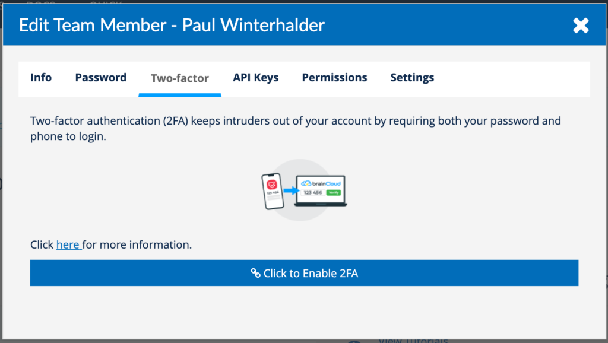
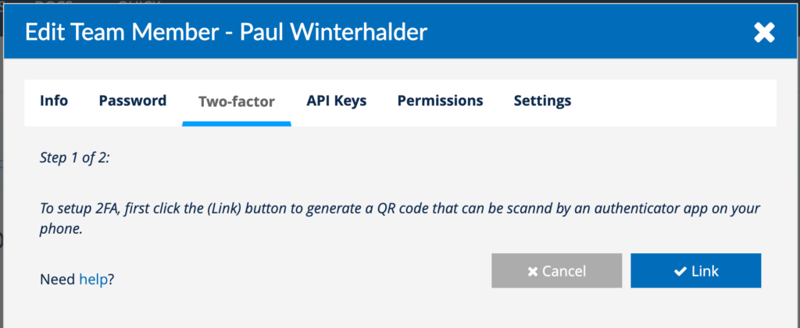
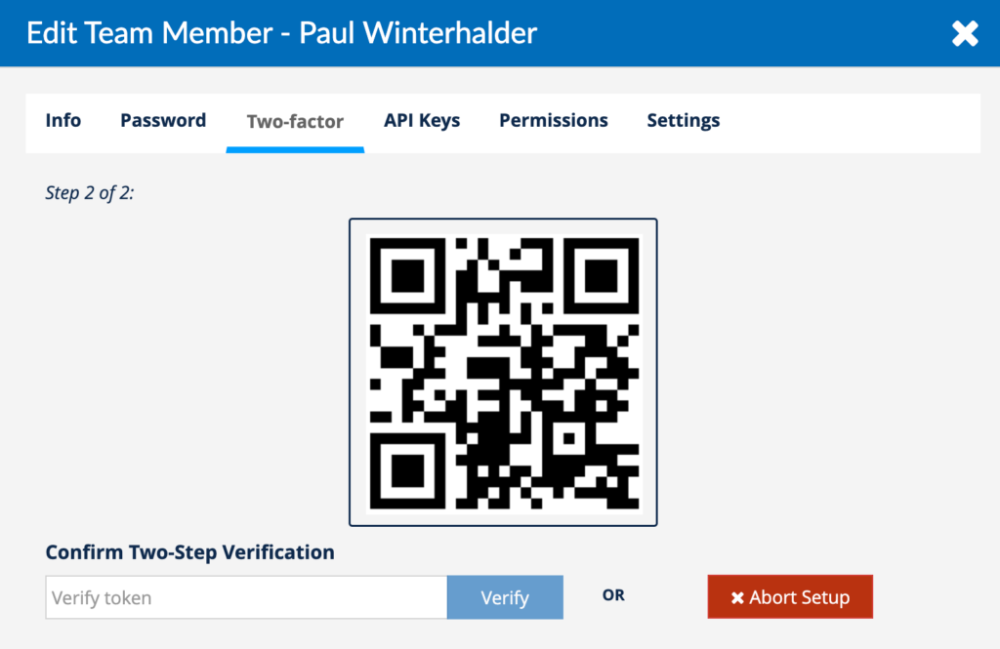
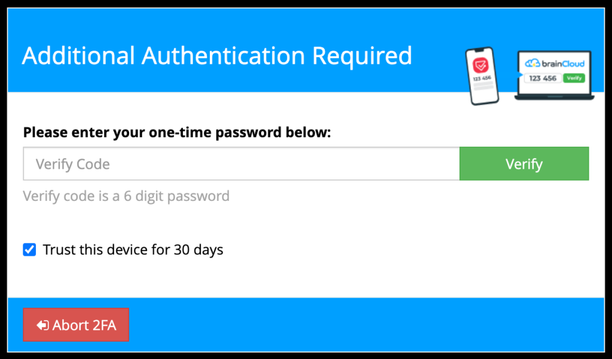
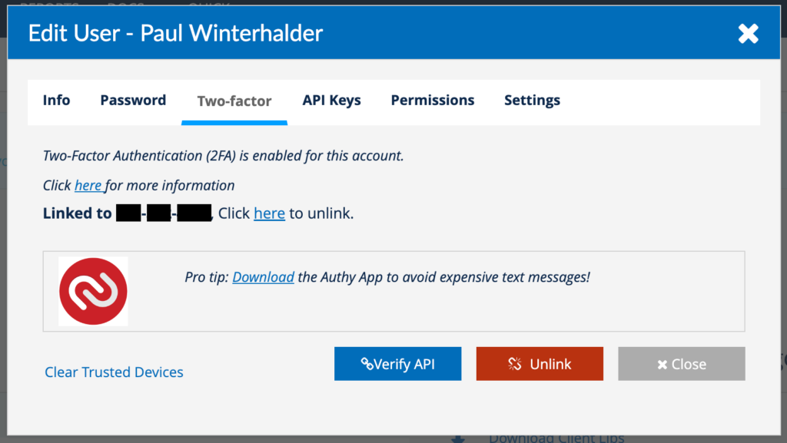
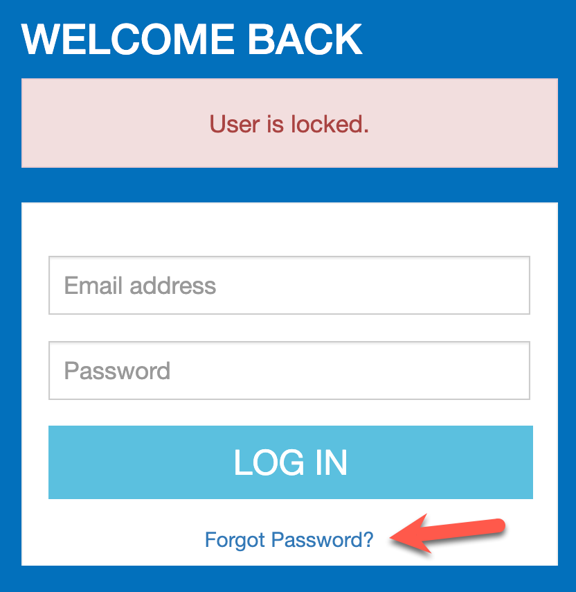

_Twilio is retiring the Authy API that brainCloud uses as of May 1, 2023._

All 2FA users **MUST** migrate to our new Google Authenticator compatible system by May 1st, 2023.

Users who do not migrate by that date will find their accounts locked as a security precaution. See the FAQ below for instructions on how to re-enable your account.

* * *

## Enabling the new 2FA

The good news is that our updated solution (which uses the Twilio Verify API), is _Google Authenticator_ compatible - so you can use any compatible app - including:

- **Google Authenticator**
- **Microsoft Authenticator**
- **Twilio Authy**

_(Why is Authy on this list? Although Twilio has terminated the Authy Server API - they continue to fully support the app. It is still a good authenticator that works well across multiple devices.)_

Configuring the new 2FA is simple:

- Click on **your name** in the top-right corner of the Portal
- Choose **Edit Profile**
- Navigate to the **Two-factor** tab

You will see one of the following two screens. If you've previously enabled our Authy-based 2FA - you will see a screen that looks like this:

If you are enabling 2FA for the first time, you will see a screen that looks like this:

Click either the **\[Verify API\]** or **\[Click to Enable 2FA\]** button - depending upon the dialog you see - to continue.

Click the **\[Link\]** button to continue.

Then get your Authenticator app out - and scan the QR code on the next page.

And finally, enter the code displayed in the app to finalize linking your account.

That's it. Your account is now configured with our shiny new 2FA system.

The next time you login, you'll see this prompt:

Note that you can choose to have brainCloud remember your device (so that you don't have to re-enter the Authenticator code at each login) for 30 days.

* * *

## Frequently Asked Questions

### How can I tell if my account is using Authy-based 2FA?

The easiest way to be is to check your user settings:

- Click on **your name** in the top-right corner of the Portal
- Choose **Edit Profile**
- Navigate to the **Two-factor** tab

If you see that your account is **linked to a phone number** (and the **red Authy logo** below it) - then your account is currently using Authy for 2FA verfication.

### What will happen if I don't migrate by May 1, 2023?

At the stroke of midnight UTC on April 30th, we will **lock all accounts** using Authy 2FA that have not migrated to the Verify API. This is to prevent any nefarious actors from being able to log into a newly unprotected account.

To re-enable their accounts, users will need to invoke the "Forgot Password" link on the Portal - which will email them a link to use to reset their password. (This proves that the actor logging in has access to the user's email account).

Once reset, the user will be able to log back into their account.

Advice

Upon logging in, we recommend that users immediately enable the new Verify API authentication via the instructions above.

### I like the Authy App. Can I still use it?

We like it too! And yes you can.

You can use Authy as your Google Authenticator app for validating brainCloud Portal logins. (And note, although Twilio is no longer supporting the Authy API, they have stated that Authy is still supported as a client app for this very purpose).

Unfortunately that doesn't give us the one-touch capability that brainCloud users used to enjoy. Twilio says that they are working to enhance their APIs to support Authy One-touch in the future - but there is no timeframe for delivery. If/when it becomes available, we will strongly consider supporting it.
